# Kiến trúc hệ thống chi tiết

> Bổ sung cho `docs/MVP_PRODUCT_ARCHITECTURE.md` — tài liệu đó giải thích
> *tại sao*, file này vẽ *như thế nào* bằng sơ đồ Mermaid (render được trực
> tiếp trên GitHub/GitLab và VS Code preview). Mỗi sơ đồ có đoạn giải thích
> ngắn ngay phía trên.

## Mục lục

1. [Tổng quan thành phần hệ thống](#1-tổng-quan-thành-phần-hệ-thống)
2. [Flow: câu hỏi pháp lý qua Agentic RAG](#2-flow-câu-hỏi-pháp-lý-qua-agentic-rag)
3. [Ví dụ minh hoạ: câu hỏi đa domain](#3-ví-dụ-minh-hoạ-câu-hỏi-đa-domain)
4. [Flow: đồng bộ & xuất bản văn bản pháp luật](#4-flow-đồng-bộ--xuất-bản-văn-bản-pháp-luật)
5. [Mô hình dữ liệu vòng đời văn bản](#5-mô-hình-dữ-liệu-vòng-đời-văn-bản)
6. [Kiến trúc triển khai AWS](#6-kiến-trúc-triển-khai-aws)
7. [Flow CI/CD](#7-flow-cicd)
8. [Flow observability — trace đi đâu](#8-flow-observability--trace-đi-đâu)
9. [Sơ đồ flow cho tính năng mở rộng (vai trò, cộng tác, tích hợp)](#9-sơ-đồ-flow-cho-tính-năng-mở-rộng)

---

## 1. Tổng quan thành phần hệ thống

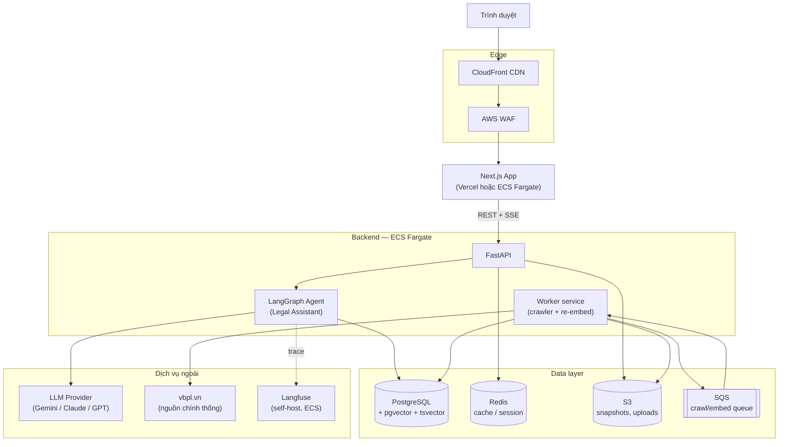

**Đọc sơ đồ:** người dùng chỉ chạm vào Next.js qua CDN/WAF; mọi nghiệp vụ nằm
trong `Agent` (LangGraph) được FastAPI gọi; `Worker` là service tách biệt lo
crawl + re-embed, không nằm trên đường request của người dùng nên không ảnh
hưởng latency chat. `Langfuse` nhận trace bất đồng bộ (đường nét đứt) — không
chặn response nếu Langfuse chậm/lỗi.

## 2. Flow: câu hỏi pháp lý qua Agentic RAG

Chi tiết hoá graph LangGraph đã mô tả ở `MVP_PRODUCT_ARCHITECTURE.md` mục 3,
vẽ đủ nhánh rẽ (multi-domain, validity, confidence gate):

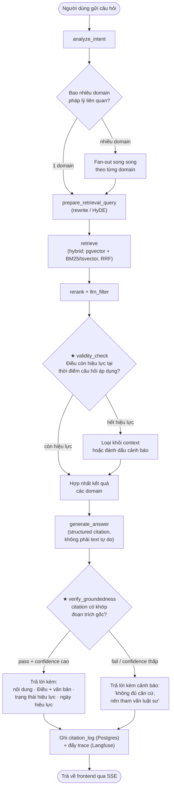

Hai node ★ (`validity_check`, `verify_groundedness`) là phần mới so với RAG
một bước thông thường — xem lý do ở mục 3–4 của
`MVP_PRODUCT_ARCHITECTURE.md`.

## 3. Ví dụ minh hoạ: câu hỏi đa domain

Minh hoạ cụ thể cho pain point "câu hỏi chạm nhiều lĩnh vực luật cùng lúc":

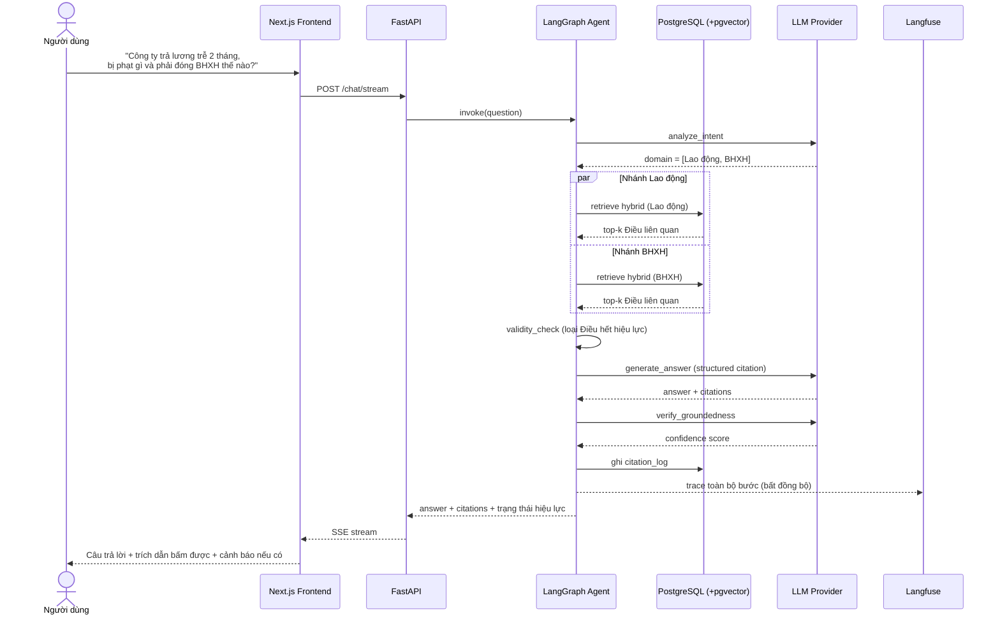

Hai nhánh `par` chạy song song — đây chính là lý do cần agentic (fan-out/merge)
thay vì một lần retrieve đơn giản.

## 4. Flow: đồng bộ & xuất bản văn bản pháp luật

Chi tiết hoá pipeline ở mục 2.3 của `MVP_PRODUCT_ARCHITECTURE.md`:

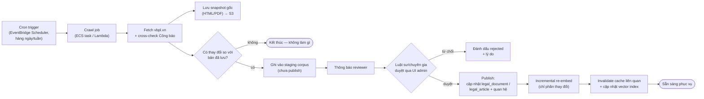

**Điểm mấu chốt:** bước "Luật sư/chuyên gia duyệt" là **bắt buộc**, không
phải optional — không có văn bản nào lên production mà chưa qua review thủ
công (xem rủi ro ở mục 2.3 và 14 của tài liệu chính). Sự kiện publish ở đây
cũng là điểm khởi phát cho flow "cảnh báo thay đổi luật" — xem
[§9.6](#96-flow-cảnh-báo-thay-đổi-luật-liên-quan-tính-năng-5).

## 5. Mô hình dữ liệu vòng đời văn bản

Chi tiết hoá schema ở mục 5 của `MVP_PRODUCT_ARCHITECTURE.md`. Mô hình tổ
chức/vai trò (`ORGANIZATION_MEMBER`) chi tiết hoá mục 6 — ERD đầy đủ cho cả
12 tính năng mở rộng (mời thành viên, feedback, watchlist, calculator,
escalation, Zalo, partner...) ở [§9.1–§9.4](#91-erd-mở-rộng-tổ-chức--phân-quyền):

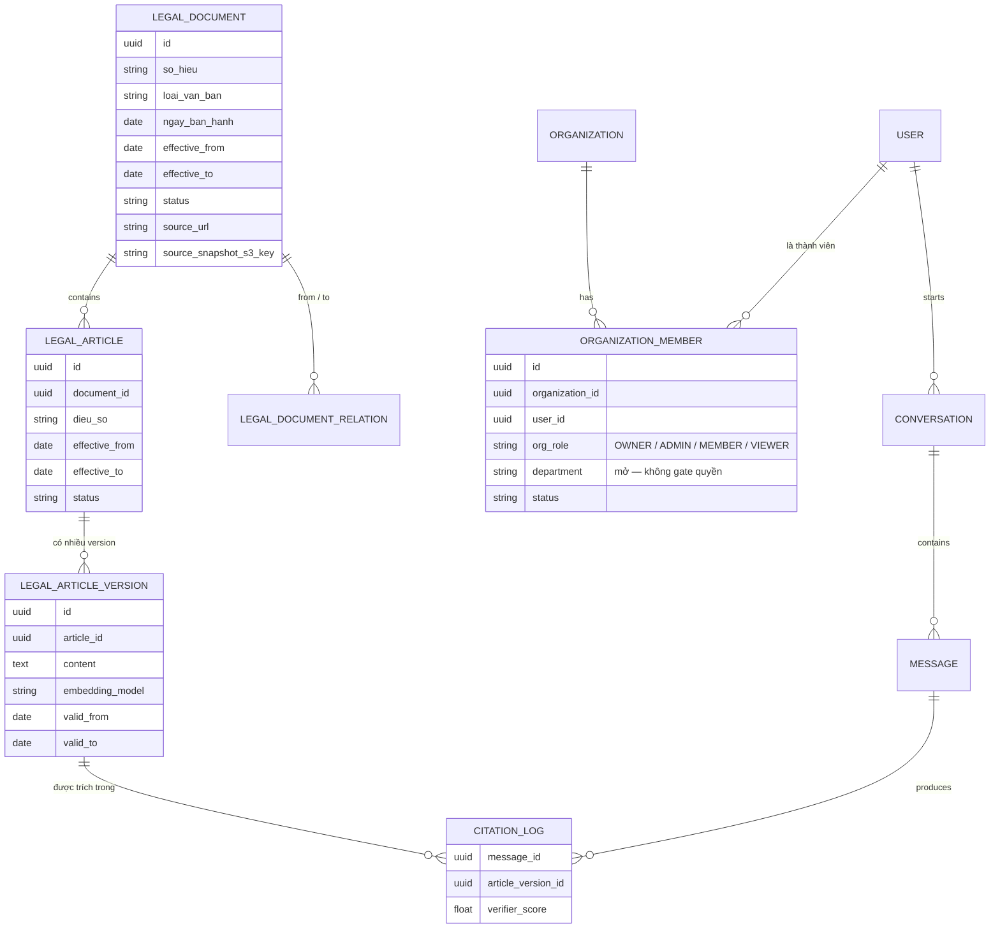

`LEGAL_ARTICLE_VERSION` là bảng trả lời được câu hỏi "tại thời điểm X áp dụng
bản nào" — `CITATION_LOG` trỏ thẳng vào version cụ thể, không chỉ số Điều, để
audit được chính xác hệ thống đã dùng bản nào khi trả lời.

## 6. Kiến trúc triển khai AWS

Chi tiết hoá mục 13 của `MVP_PRODUCT_ARCHITECTURE.md`:

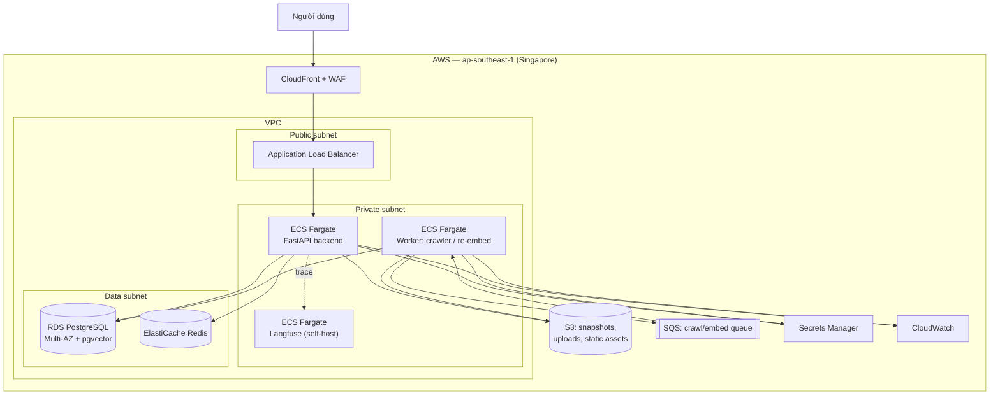

MVP có thể bỏ Multi-AZ/autoscale (chạy 1 task mỗi service) để tiết kiệm chi
phí — scale lên khi có traffic thật, cấu trúc VPC/subnet giữ nguyên.

## 7. Flow CI/CD

Chi tiết hoá mục 12 của `MVP_PRODUCT_ARCHITECTURE.md`:

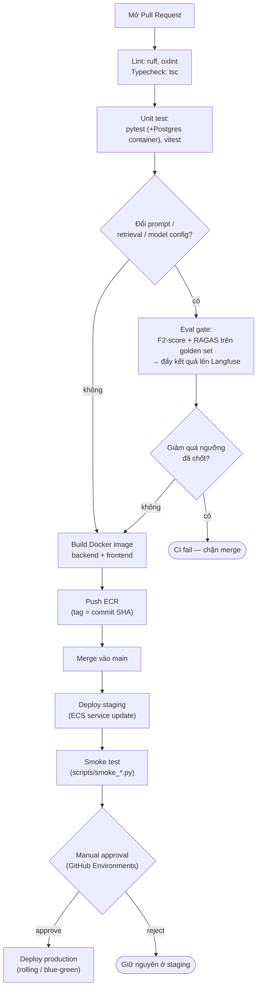

Pipeline cập nhật corpus (mục 4 ở trên) chạy **tách biệt** với pipeline CI/CD
code — không gắn vào PR, chạy theo lịch crawl riêng.

## 8. Flow observability — trace đi đâu

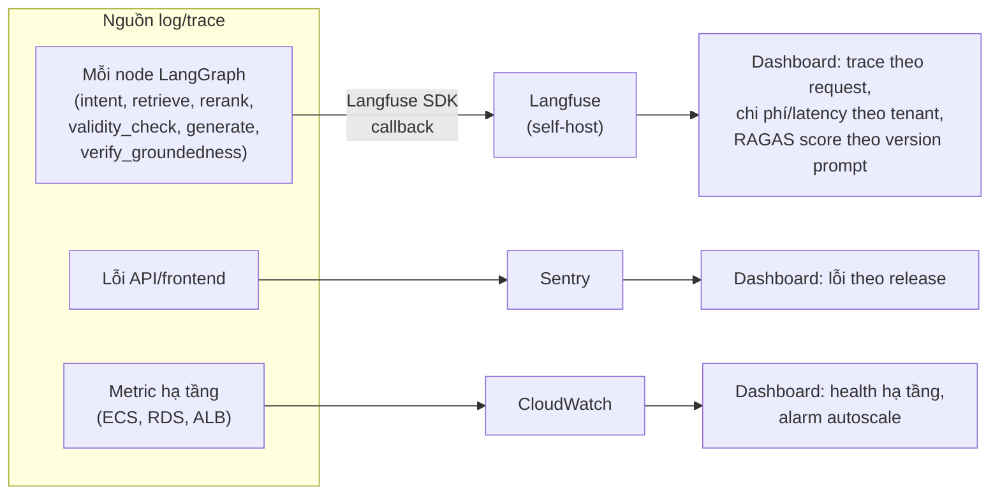

Ba hệ thống tách biệt theo đúng mục đích (LLM trace / lỗi ứng dụng / hạ tầng)
— không dồn hết vào một nơi để tránh dashboard quá tải tín hiệu không liên
quan khi debug.

## 9. Sơ đồ flow cho tính năng mở rộng

Chi tiết hoá mục 9 (12 tính năng) của `MVP_PRODUCT_ARCHITECTURE.md` và đặc tả
đầy đủ flow/API contract ở [`FEATURES.md`](FEATURES.md). Phần này chỉ vẽ ERD
mở rộng + các flow nhiều bước đáng vẽ nhất; những tính năng còn lại (dashboard,
calculator, so sánh phương án) là CRUD/aggregation đơn giản, đã đủ rõ ở dạng
API contract trong `FEATURES.md`, không cần thêm sơ đồ.

### 9.1 ERD mở rộng — tổ chức & phân quyền

Chi tiết hoá mục 6 của `MVP_PRODUCT_ARCHITECTURE.md` — thay thế quan hệ
`User 1-N Organization` hiện tại bằng N-N qua `ORGANIZATION_MEMBER`:

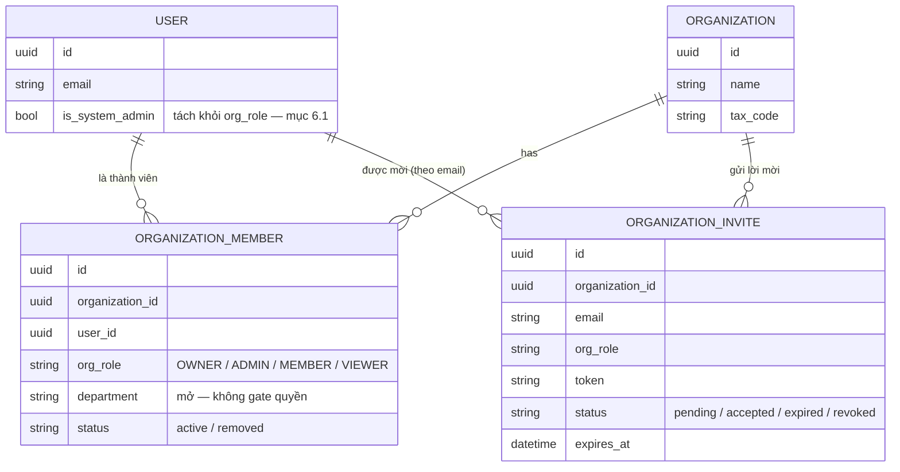

### 9.2 ERD mở rộng — tương tác & cộng tác nội bộ

Entity cho tính năng #2 (liên kết hợp đồng↔tuân thủ), #3 (feedback), #4
(nhắc email), #9 (escalation):

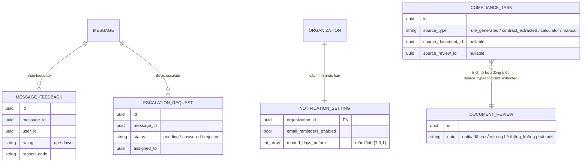

### 9.3 ERD mở rộng — theo dõi hiệu lực & tính toán

Entity cho tính năng #5 (cảnh báo thay đổi luật) và #7 (máy tính nghĩa vụ):

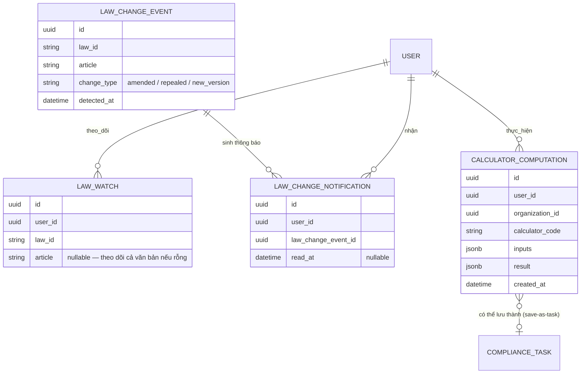

### 9.4 ERD mở rộng — tích hợp ngoài

Entity cho tính năng #10 (Zalo OA) và #12 (API đối tác):

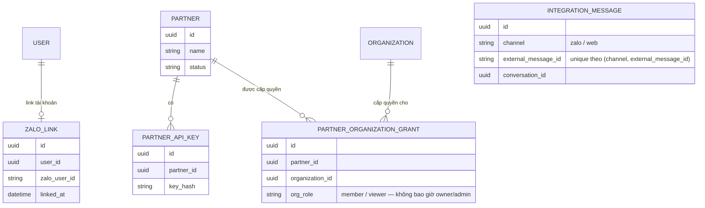

`INTEGRATION_MESSAGE` không có quan hệ vẽ sẵn ở trên vì vai trò của nó là
**chặn trùng** khi Zalo retry webhook (tra theo `external_message_id` trước
khi xử lý), không phải để truy vấn/join thường xuyên.

### 9.5 Flow: mời thành viên vào tổ chức (tính năng #1)

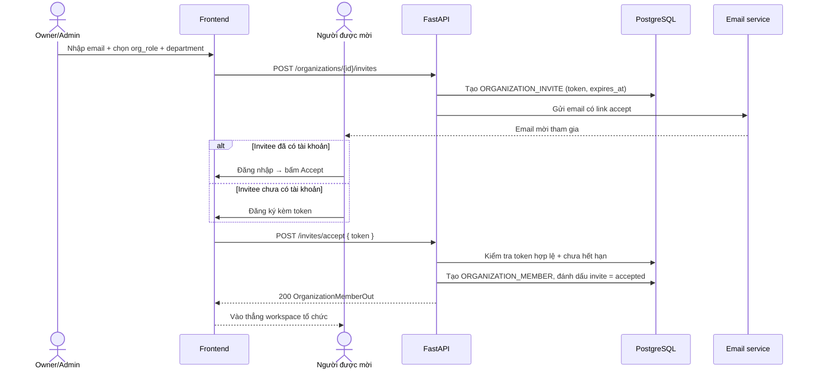

### 9.6 Flow: cảnh báo thay đổi luật liên quan (tính năng #5)

Mở rộng trực tiếp từ flow đồng bộ ở [§4](#4-flow-đồng-bộ--xuất-bản-văn-bản-pháp-luật) —
bắt đầu từ bước "Publish" của sơ đồ đó:

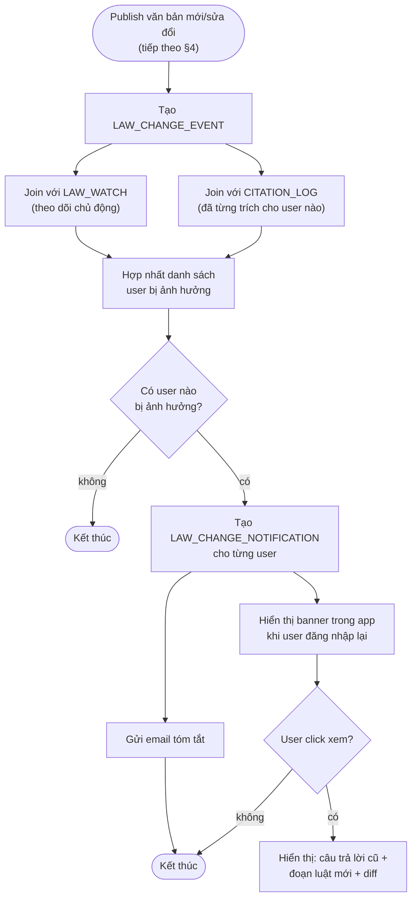

### 9.7 Flow: case builder — node `clarify` (tính năng #6)

Chèn thêm vào đầu graph agentic RAG ở [§2](#2-flow-câu-hỏi-pháp-lý-qua-agentic-rag),
trước `prepare_retrieval_query`:

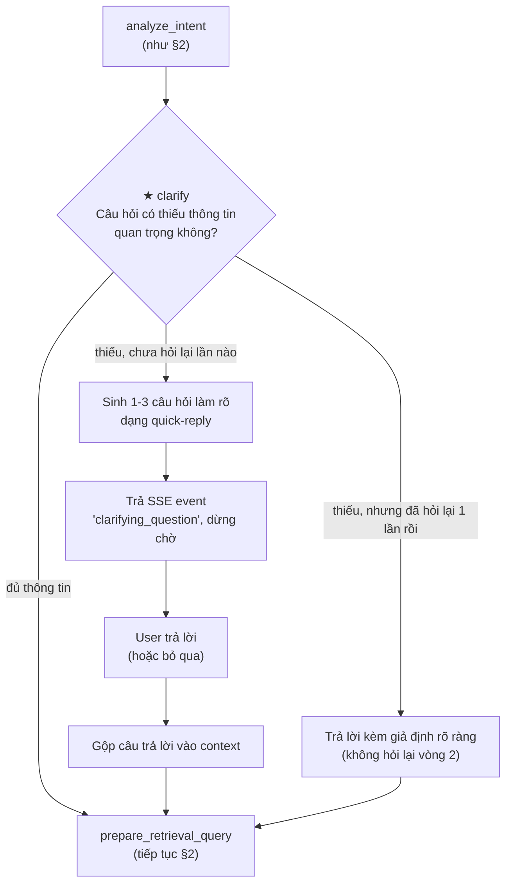

### 9.8 Flow: escalation sang chuyên gia thật (tính năng #9)

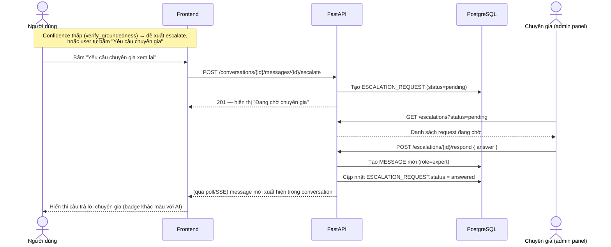

### 9.9 Flow: Zalo OA integration (tính năng #10)

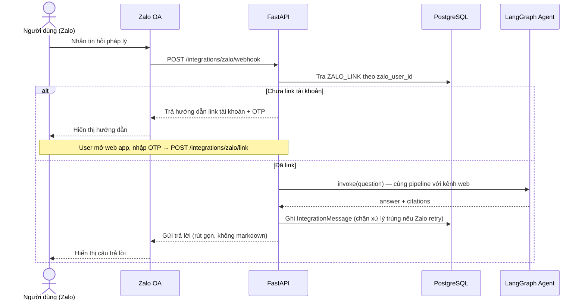

### 9.10 Kiến trúc API đối tác (tính năng #12)

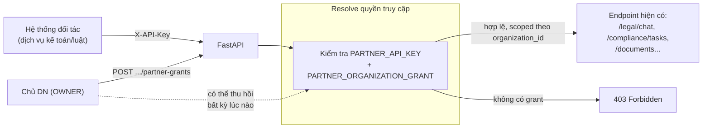

Chủ DN luôn giữ quyền thu hồi (`DELETE .../partner-grants/{partner_id}`) —
Partner không bao giờ sở hữu `Organization`, chỉ được **grant** quyền truy
cập có thể huỷ.
